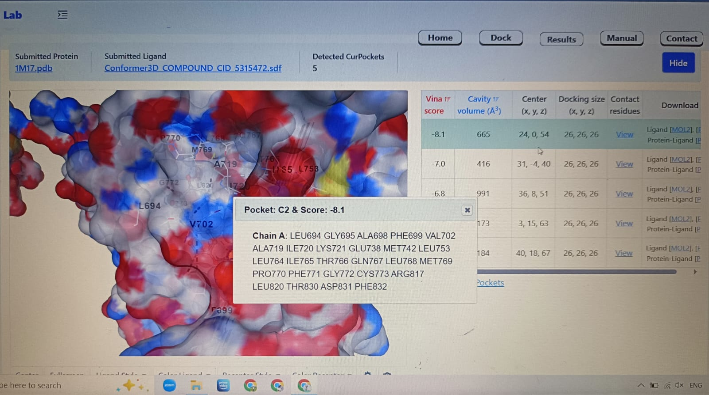
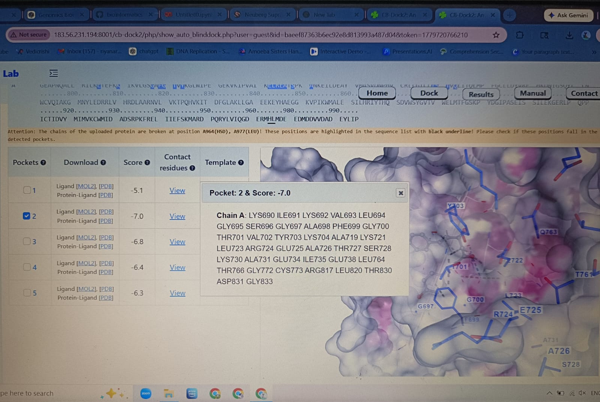
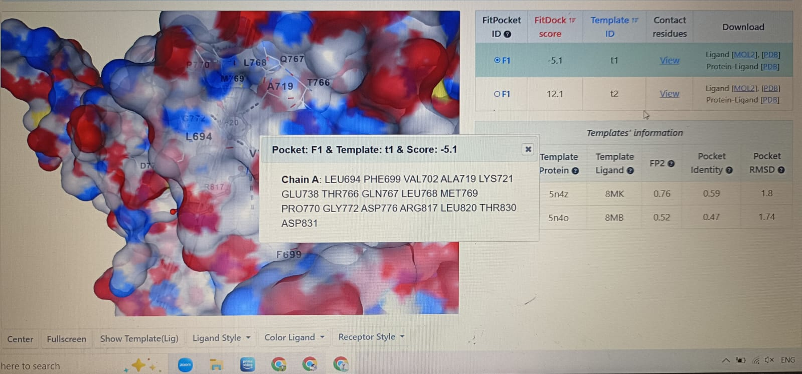

# Bioinformatics Projects

## Project 1 — DNA Sequence Classification using Machine Learning

This project uses machine learning to classify biological DNA sequences.

### Features
- Automatic sequence retrieval from NCBI
- One-hot encoding of DNA
- Dataset generation
- Random Forest classification
- Confusion matrix analysis

### Tools Used
- Python
- Biopython
- Scikit-learn
- NCBI Entrez

---

## Project 2 — Protein Ligand Docking

This project performs molecular docking between EGFR protein and ligands using online docking tools.

### Features
- Protein structure retrieval from PDB
- Ligand retrieval from PubChem
- Blind docking
- Binding pocket analysis
- Docking score evaluation

### Tools Used
- RCSB PDB
- PubChem
- CB-Dock2
 ### Results

- Best docking score obtained: -8.1
- Binding pocket residues were identified successfully
- Protein-ligand interaction visualization completed

### Docking Images

---

## AI-Assisted Drug Discovery

This project combines molecular docking with machine learning to classify ligands as strong or weak binders against EGFR protein.

### Machine Learning Workflow
- Docking scores collected from CB-Dock2
- Ligands classified into strong and weak binders
- Random Forest Classifier trained using docking scores
- Model evaluated using confusion matrix

### ML Result

